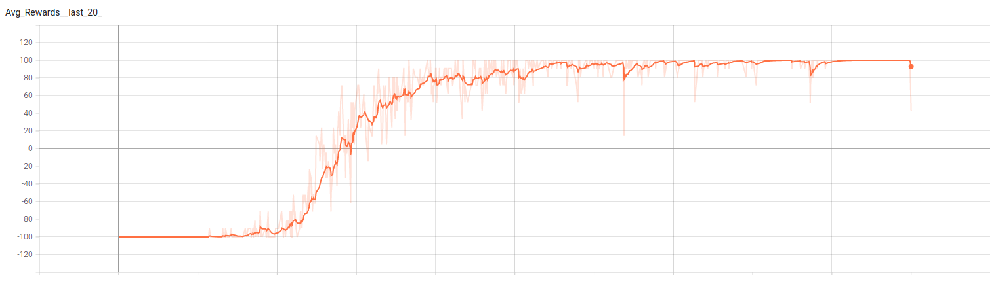

# Kothrak

Ce dépôt s'inspire du jeu de plateau Santorini et essai d'y implémenter une Intelligence Artificielle.
Pour ce faire, nous essayons d'entrainer via renforcement un DQN (Deep Q-Network).

Actuellement, nous avons un programme capable de s'entrainer sur une partie où seul un joueur est présent.
Son objectif est d'atteindre une position d'étage 3. S'il l'atteint, il reçoit +100 en récompense. A l'inverse, s'il essai d'effectuer un coup impossible (coup en dehors du plateau, déplacement sur un étage inateignable, construction sur un étage de hauteur 3) il perds la partie et reçoit une punition de -100. Il n'y a pas de coup maximum pour gagner la partie. Ainsi, si un joueur ne perds jamais, il finira nécessairement par gagner.
Aujourd'hui, lancer `python3 main.py` permet d'ouvrir la fenêtre de jeu. Il est alors possible de lancer l'entrainement en cliquant sur `Run N Games`.

Nous pouvons observer ici que le DQN fini par converger. Dans cet exemple, au bout de 40.000 parties.
Cet exemple utilise un réseau de 4 couches relu de 120 neurones, et une output linear de 6 neurones.
L'entrée correspond à la vision des cells autour du joueurs sur un rayon de deux : leur hauteur (ramenée entre 0 et 1), et la présence d'un joueur (0 ou 1).  Elle prends aussi deux boolean indiquant l'étape de jeu : *Move* ou *Build*.
