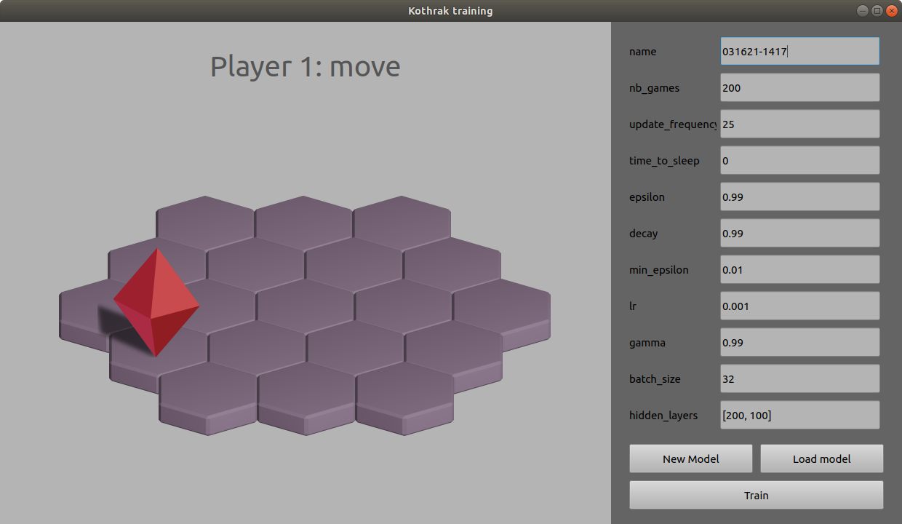

# Kothrak

Ce projet a pour objectif d'expérimenter l'apprentissage par renforcement et les réseaux de neurones (Deep Q-Network) en implémentant une intelligence artificielle dans un jeu inspiré du jeu de plateau Santorini.

## Installation

Pour cloner le dépôt
```bash
git clone https://github.com/Naowak/Kothrak
cd Kothrak
```
Pour faciliter l'installation, nous pouvons créer un environnement virtual avec virtualenv (Version 3.6, 3.7 et 3.8 de python compatibles), l'activer, et procéder à l'installation des dépendances avec pip
```bash
virtualenv venv
source venv/bin/activate
pip install -r requirements.txt
```
Vous pouvez maintenant lancer l'interface
```bash
python main.py
```

## Santorini

 

Santorini est un jeu de plateau tour par tour et multijoueur dont le but est d'être le premier joueur à atteindre le 3ème étage.  
A tour de rôle, chaque joueur a deux actions à effectuer : un **déplacement** d'une case, puis la **construction** d'un étage sur une case adjaçante à sa position. Un joueur ne peut se déplacer ou construire sur une case occupée par un autre joueur, ou de hauteur 4 (ayant un dôme). Si un joueur ne peut pas effectuer l'une de ces deux actions, il perd la partie.  
- **Déplacement** : Un joueur ne peut pas se déplacer sur une case ayant 2 étages ou plus que la case sur laquelle il se trouve. En revanche, il peut descendre d'autant d'étage qu'il le souhaite.  
*Explication : Un joueur ne peut donc pas se déplacer sur une case de hauteur 3 s'il est sur une case de hauteur 0 ou 1, ni sur une case de hauteur 2 s'il est sur une case de hauteur 0. En revanche, il peut descendre d'une case de hauteur 2 à une case de hauteur 0 ou 1.*  
- **Construction** : Un joueur peut construire sur une case de hauteur 0, 1, 2, ou 3. S'il construit sur une case de hauteur 3, il construit un dôme, scellant la case jusqu'à la fin de la partie. Plus aucun joueur ne sera en mesure de se déplacer dessus ou d'y construire un étage. 

## Avancement

Actuellement, le jeu ne permet qu'un seul joueur, et la création de dôme n'est pas encore implémenter.  
L'objectif de notre joueur est alors d'atteindre une case d'étage 3. S'il l'atteint, il reçoit +100 en récompense. A l'inverse, s'il essai d'effectuer un coup impossible (coup en dehors du plateau, déplacement sur un étage inateignable, construction sur un étage de hauteur 3), il perd la partie et reçoit une punition de -100. Il n'y a pas de nombre de coup maximum pour gagner la partie. Ainsi, si un joueur ne perd jamais, il finira nécessairement par gagner. 



Pour obtenir cet interface il faut lancer la commande `python3 main.py`. Il est alors possible de charger un modèle en cliquant sur `Load model` et de lancer l'entrainement en cliquant sur `Train`. Vous pouvez aussi créer un nouveau modèle grâce au bouton `New Model`. Grâce à cette interface nous pouvons facilement paramètrer nos entrainements.

Nous arrivons à entrainer un DQN pour qu'il finisse par gagner 100% de ses parties (il atteint le troisième étage sans mourir).  
Plusieurs combinaisons de paramètres permettent d'obtenir un tel résultat plus ou moins rapidement.   
- Avec des paramètres tels que *{epsilon = 0.99, decay = 0.8, hidden_units=[150]}* nous pouvons obtenir une IA qui commence à converger à partir de 80 games, et qui peut gagner 100% de ses parties au bout d'environ 200 parties.
- Avec des paramètres tels que *{epsilon = 0.99, decay = 0.9998, hidden_units=[120, 120, 120, 120]}* nous pouvons obtenir une IA qui gagne 100% de ses parties après 40.000 games d'entrainement.   

Même si ces deux IA réussissent toutes deux à gagner 100% de leur partie, il semblerait qu'elle n'ai pas la même stratégie, et que l'IA ayant appris sur 80 games soit moins robuste (elle connait moins de différentes situations, et peut donc faire rapidement n'importe quoi si elle rencontre un état qu'elle n'a pas l'habitude de rencontrer).


Dans cet exemple, le DQN fini par converger au bout de 40.000 parties.  
Cet exemple utilise un réseau de 4 couches relu de 120 neurones, et une output linear de 6 neurones. L'entrée correspond à la vision des cases autour du joueur sur un rayon de 2 : leur hauteur (ramenée entre 0 et 1), et la présence d'un joueur (0 ou 1). Elle prends aussi deux boolean indiquant l'étape de jeu : *Move* ou *Build*.

## Observations

Deux systèmes d'états ont été implémenter pour ce projet : l'un dit **relatif**, l'autre dit **absolu**.
- Le système d'état **relatif** centre toujours le joueur au milieu de son système d'état. Il offre comme information au joueur une "vision" du jeu à partir de sa position. Ainsi le joueur peut voir dans un cercle de rayon 2 autour de lui. Il peut donc voir les cellules en dehors de la map, indiquées de hauteur 0. Cependant, si le rayon de vision n'est pas deux fois supérieur au rayon du plateau de jeu, le joueur ne verra pas systématiquement toutes les cellules du plateau.
Dans ce système d'état, la hauteur des cellules est indiquée par un premier vecteur dont les valeur sont ramenées entre 0 et 1, puis la présence ou non d'un d'adversaire sur une cellule est indiqué par un second vecteur boolean.
- Le système d'état **absolu** ne montre que les cellules existantes, et indique alors leur hauteur dans un premier vecteur dont les valeur sont ramenées entre 0 et 1, puis la présence ou non d'un joueur sur une cellule est indiqué par un second vecteur boolean. Pour indiquer la position du joueur : à revoir ! 

Nous pouvons observer que ces deux systèmes d'état permettent à une IA un joueur de converger, mais nous pouvons constater quelques différences : le système d'état **absolu** converge en trouvant un endroit spécifique dans la map (un couple de deux cellules) où il arrive à atteindre le troisième niveau, et essai alors systématiquement de rejoindre cet endroit pour gagner la partie. Alors que le système d'état **relatif** est en mesure de trouver la victoire sur plusieurs couples de cellules différents, mais conservera la même relation adjaçante (le couple de cellule qu'il utilisera sera toujours agencer pareil : deux cellules en diagonales, ou deux cellules horizontales par exemple).


## To-do

- Un réseau de neurone par actions
- Prédire les deux actions d'un coup
- Mettre en place le multijoueur
- Ajouter les dômes
